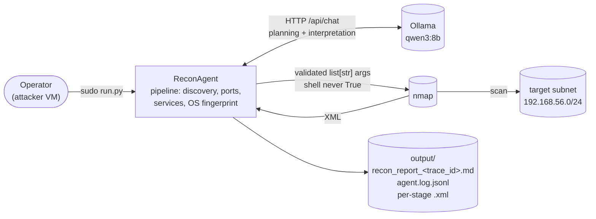

# Dark Agents

Autonomous MITRE ATT&CK reconnaissance agent for isolated network
environments. Runs on a locked-down attacker VM, uses a local LLM
(Ollama) to plan nmap scans against a target subnet, executes those
scans with hard safety checks, and emits a Markdown report mapped to
MITRE techniques plus a structured JSONL log.

Lab-scoped MVP. Not a production security tool.

---

## Architecture at a glance



The agent runs a fixed four-stage pipeline per subnet: `host_discovery`
→ `port_scan` → `service_enum` → `os_fingerprint`. For each stage the
LLM proposes scan parameters; guardrails validate them; code builds the
concrete nmap command; the executor runs it as a `list[str]` (`shell` is
never set to True) with a hard timeout; the parser extracts structured findings into state; a
second LLM call produces advisory analysis for the report. See
[docs/architecture.md](docs/architecture.md) for the module-by-module
walkthrough and per-stage sequence diagram.

## Safety boundary

Three rules, enforced in code and covered by tests:

- **No scan outside `target_subnet`.** Every LLM-proposed target is
  checked by [`agent/src/guardrails.py`](agent/src/guardrails.py)
  against the configured subnet. Violations are rejected before any
  command is built.
- **Attacker IP never scanned.** `host_discovery` auto-excludes the
  attacker IP via `--exclude`; the three per-host stages reject it as
  a target.
- **No LLM-authored shell.** Commands are built from validated
  primitives by
  [`agent/src/command_builder.py`](agent/src/command_builder.py) and
  dispatched as `list[str]` via `subprocess.run(...)` in
  [`agent/src/tool_executor.py`](agent/src/tool_executor.py) — the
  executor relies on Python's default (`shell=False`) and tests assert
  `shell` is never set to `True`.

## Prerequisites

- Python 3.10 or newer.
- [`uv`](https://docs.astral.sh/uv/) on `PATH` (project/package manager
  used for dependency install and test running).
- `nmap` at the path given by `nmap_path` in the config (default
  `/usr/bin/nmap`).
- Ollama reachable at `ollama_url` with the configured model pulled
  (default `qwen3:8b`). See
  [docs/ollama-setup-guide.md](docs/ollama-setup-guide.md).
- Root for real runs (nmap needs raw-socket capabilities). Dry-run
  validates the config without root and without touching nmap or
  Ollama.

## Quick start

Install dependencies:

```bash
cd agent
uv sync --extra dev
```

Validate the config end-to-end without running a scan or touching the
network (no root needed):

```bash
cd agent
uv run python run.py --config config/default.yaml --dry-run
```

Run the full pipeline (root required):

```bash
cd agent
sudo "$(command -v uv)" run python run.py --config config/default.yaml
```

The `$(command -v uv)` expansion is a workaround for Ubuntu's
`sudo secure_path`, which does not include `~/.local/bin` by default.
The subshell resolves `uv` in the calling user's `PATH` before `sudo`
runs, so you do not need to add `~/.local/bin` to `secure_path`. See
[docs/porting-guide.md](docs/porting-guide.md) for the attacker-VM
bring-up and troubleshooting matrix.

On completion the last line of stdout is the path to the generated
Markdown report. With the shipped `output_dir: "./output"` it is
relative to the agent's CWD (e.g. `output/recon_report_<trace_id>.md`);
set `output_dir` to an absolute path in your config if you need
absolute output.

## Configuration

All runtime parameters live in YAML. The shipped default is
[`agent/config/default.yaml`](agent/config/default.yaml). Required
fields: `ollama_url`, `model`, `target_subnet`, `attacker_ip`,
`nmap_path`. Optional fields cover pipeline stages, per-stage timeouts
and sampling parameters, output directory, and the global wall-clock
budget (`max_total_duration_seconds`).

For a porting checkout, keep `default.yaml` pristine and create
`agent/config/remote.yaml` from it for host-specific values (see
[docs/porting-guide.md](docs/porting-guide.md)).

The `OLLAMA_URL` environment variable overrides the YAML `ollama_url`
at load time — useful when the inference server's IP changes mid-session
and editing YAML is not worth it:

```bash
export OLLAMA_URL="http://192.168.1.50:11434"
```

## What you'll see when it runs

During a real run, stderr streams short human-readable status lines
(one per LLM call, command execution, state update, and stage
completion) while the authoritative record goes to JSONL. A complete
run against a populated subnet produces, inside `agent/output/`:

- one `recon_report_<trace_id>.md` — the Markdown report, with MITRE
  sections, Discovered Hosts, Service Inventory, Agent Analysis
  (advisory), and a Pipeline Execution Summary,
- one `agent.log.jsonl` (append mode) — every planning call,
  interpretation call, command executed, guardrail violation, state
  update, stage completion, and `error` event (the seventh event
  type — `guardrail_violation` only fires on a violation, not on a
  successful pass), each with a common envelope (`timestamp`, `trace_id`,
  `span_id`, `parent_span_id`, `surface`, `event_type`, `stage`,
  `stage_attempt`, `host_target`),
- one XML file per executed nmap command, named
  `<stage>_<target>_<UTC_timestamp>.xml`.

Shortly after `run.py` prints the report path, `ls -t agent/output/ |
head` shows the freshest artifacts. See
[docs/runtime-findings.md](docs/runtime-findings.md) for observed
runtime behavior and example event sequences, and
[docs/architecture.md](docs/architecture.md) §10 for the JSONL schema.

## Running the tests

```bash
cd agent
uv run pytest tests/ -v
```

Single file or single test:

```bash
cd agent
uv run pytest tests/test_guardrails.py -v
uv run pytest tests/test_guardrails.py::test_rejects_attacker_ip -v
```

Lint and format:

```bash
cd agent
uv run ruff check src tests
uv run ruff format src tests
```

## Project layout

```
.
├── agent/
│   ├── run.py                CLI entry
│   ├── config/               YAML configs (default.yaml is shipped)
│   ├── src/                  Agent modules (see docs/architecture.md)
│   └── tests/                pytest suite
├── docs/                     Architecture, guides, runtime findings
├── infra/                    Host- and VM-side bring-up scripts
├── scripts/
│   └── tmux-monitor.sh       Optional three-pane monitor helper
└── README.md
```

## Optional monitoring helper

[`scripts/tmux-monitor.sh`](scripts/tmux-monitor.sh) boots a three-pane
tmux session for watching a run live: agent console, pretty-printed
JSONL log, and a tcpdump of the isolated NIC. Requires `tmux`,
`python3`, `sudo`, `tcpdump`, and `uv` on `PATH`.

```bash
MON_IFACE=enp2s0 ./scripts/tmux-monitor.sh
AGENT_CONFIG=config/remote.yaml MON_IFACE=enp2s0 ./scripts/tmux-monitor.sh
```

`MON_IFACE` is required and intentionally has no default — the correct
NIC is host-specific. Pick the NIC whose IPv4 matches `attacker_ip` in
your agent config; that is the interface carrying scans to
`target_subnet`.

## Pointers

- [docs/architecture.md](docs/architecture.md) — shipped agent
  architecture, pipeline walkthrough, per-module reference,
  event schema.
- [docs/lab-architecture.md](docs/lab-architecture.md) — physical and
  virtual lab layout, dual-layer isolation, inference-server design.
- [docs/infra-setup-guide.md](docs/infra-setup-guide.md) — host-side
  lab bring-up (KVM host, VMs, iptables lockdown, snapshots).
- [docs/porting-guide.md](docs/porting-guide.md) — porting the agent
  onto the attacker VM: config creation, first-run checklist,
  troubleshooting matrix.
- [docs/ollama-setup-guide.md](docs/ollama-setup-guide.md) — inference
  server setup, model selection notes.
- [docs/runtime-findings.md](docs/runtime-findings.md) — observed
  model and runtime behaviors from test runs.
- [docs/current-limitations.md](docs/current-limitations.md) — design
  trade-offs, reserved surfaces, and forward-facing improvements.
