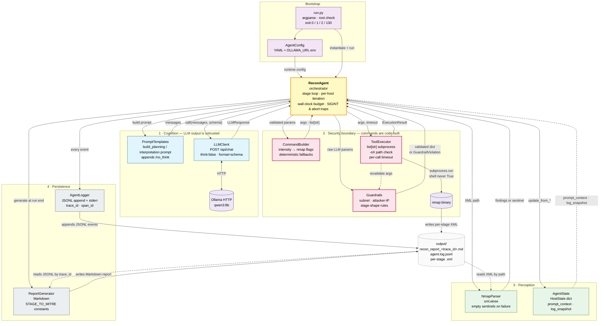
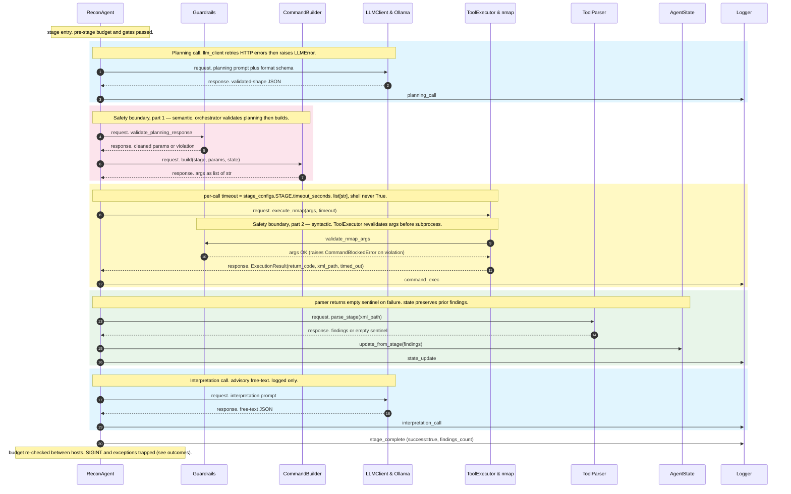
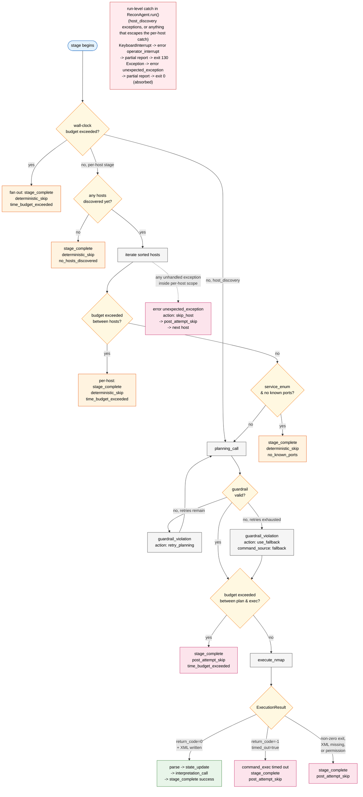

# Dark Agents — Architecture

Reference for the shipped agent. Aimed at a new maintainer or evaluator
reading cold, who expects to leave knowing what the agent does, how the
pipeline runs, where the safety boundaries live, and which module owns
which concern. This document describes what is shipped today — a
lab-scoped MVP — not a production security product.

Companion docs:

- [`docs/lab-architecture.md`](./lab-architecture.md) — physical and virtual lab layout.
- [`docs/infra-setup-guide.md`](./infra-setup-guide.md) — host-side bring-up.
- [`docs/porting-guide.md`](./porting-guide.md) — porting the agent onto the attacker VM.
- [`docs/runtime-findings.md`](./runtime-findings.md) — observed model and runtime behaviors from test runs.
- [`docs/current-limitations.md`](./current-limitations.md) — design trade-offs, reserved surfaces, and forward-facing improvements.
- [`docs/ollama-setup-guide.md`](./ollama-setup-guide.md) — inference server setup and model notes.

---

## 1. Overview

Dark Agents is an autonomous reconnaissance agent that runs on an isolated attacker VM and:

1. reads a configured target subnet from YAML,
2. calls a locally hosted LLM (Ollama, default model `qwen3:8b`) to propose nmap scan parameters for each stage of a fixed four-stage pipeline,
3. validates and rewrites those proposals into concrete nmap commands using code,
4. executes each command with hard timeouts and safety checks,
5. parses the resulting nmap XML into structured state,
6. calls the LLM a second time per stage for free-text interpretation (kept advisory, never written back into state), and
7. emits a Markdown report mapped to MITRE ATT&CK techniques plus a structured JSONL log covering every call, command, and state change.

The agent is a single Python process. It uses one external scan tool (nmap), one external AI service (Ollama via HTTP), and no other outbound network dependencies. It is designed to run in an environment where the isolated NIC of the attacker VM is the only egress, and where iptables on the NAT NIC allows only the inference server endpoint.

## 2. High-Level Architecture

The agent's internal structure splits into one orchestrator and four module layers. ReconAgent (yellow, center) is the only file that touches every other module — it threads the loop, calls each layer in turn, and owns the time budget and signal handling. Every other module has a narrower concern; durable run state is concentrated in `AgentState` and the JSONL log.

The diagram below is a **component view**, not a temporal sequence — for step-by-step timing within a stage see [§3.2](#32-per-stage-cycle-happy-path); for skip and abort branches see [§3.3](#33-outcomes-skip-categories-and-runtime-failures). Modules group into four labeled roles around the orchestrator. **Cognition** (blue) is where the LLM lives — every byte coming out of it is treated as untrusted. **Security boundary** (pink, thicker border) is the only place in the codebase that turns LLM-derived dictionaries into shell-safe nmap arguments; ToolExecutor calls Guardrails a second time before subprocess as defense in depth (the dashed arrow inside the boundary). **Perception** (green) parses XML back into typed state and never round-trips through the LLM. **Persistence** (gray) writes the JSONL log live and the Markdown report at the end; the report generator reads the JSONL log file directly by `trace_id` rather than going through the logger object — the same pattern as NmapParser reading XML files written by nmap. External processes (Ollama and nmap) are violet; bootstrap (`run.py` and `AgentConfig`) is purple. **Solid arrows are direct calls** — every arrow into or out of ReconAgent is a method invocation; no module short-circuits past the orchestrator. **Dashed arrows are passive reads or revalidation** (state queried for prompt context, per-stage XML read by the parser after nmap writes it, JSONL log re-read by the report generator, args revalidated inside the executor).



The table below lists each module, its responsibility, and whether it enforces the hard safety boundary. Paths are relative to the repository root and link to the source file on GitHub.

| Module | Responsibility | Security boundary? |
|---|---|---|
| [`agent/run.py`](../agent/run.py) | CLI entry: parse args, load config, run dry-run or real run, set exit code. | No (enforces root requirement for real runs). |
| [`agent/src/config.py`](../agent/src/config.py) | Load and validate `AgentConfig` / `StageConfig` from YAML. | No. |
| [`agent/src/llm_client.py`](../agent/src/llm_client.py) | POST to Ollama `/api/chat` with schema-constrained body; return `LLMResponse`. | No. |
| [`agent/src/prompt_templates.py`](../agent/src/prompt_templates.py) | Build planning and interpretation prompts from state; append `/no_think`. | No. |
| [`agent/src/guardrails.py`](../agent/src/guardrails.py) | Validate LLM planning output and nmap args against subnet, attacker-IP, and stage-shape rules. | **Yes.** |
| [`agent/src/command_builder.py`](../agent/src/command_builder.py) | Turn validated planning parameters into concrete `list[str]` nmap arg lists; supply deterministic fallbacks. | **Yes** (no LLM-authored shell). |
| [`agent/src/tool_executor.py`](../agent/src/tool_executor.py) | Run `nmap` via `subprocess.run(list[str], ...)` (relies on Python's default — `shell` is never set to `True`); enforce per-call timeout; validate output-path invariants. | **Yes.** |
| [`agent/src/tool_parser.py`](../agent/src/tool_parser.py) | Parse nmap XML with stdlib `xml.etree.ElementTree`; return empty sentinels on failure. | No. |
| [`agent/src/state.py`](../agent/src/state.py) | `AgentState` / `HostState` dataclasses; update from parsed findings; emit prompt context and log snapshots. | No. |
| [`agent/src/logger.py`](../agent/src/logger.py) | Append-only JSONL log with a common envelope on every event; mirror status lines to stderr. | No. |
| [`agent/src/report_generator.py`](../agent/src/report_generator.py) | Build Markdown report from state plus `interpretation_call` events; MITRE mapping is a code constant. | No. |
| [`agent/src/agent/recon_agent.py`](../agent/src/agent/recon_agent.py) | `ReconAgent` orchestrator: pipeline loop, per-host iteration, budget checks, signal handling. | No. |
| [`agent/src/agent/planning.py`](../agent/src/agent/planning.py) | `_PlanningMixin`: planning-call loop, guardrail retries, fallback dispatch. | No. |
| [`agent/src/agent/runtime.py`](../agent/src/agent/runtime.py) | `_RuntimeMixin`: command execution, parsing, state update, interpretation call, skip emission. | No. |
| [`agent/src/agent/outcomes.py`](../agent/src/agent/outcomes.py) | `HostStageOutcome` dataclass — ephemeral per-host orchestration metadata; never enters prompts. | No. |

Security-boundary modules (guardrails, command_builder, tool_executor) are the three files that enforce the non-negotiable rule: *no LLM output ever becomes shell*. Everything nmap sees is built from a validated parameter dict or a code-held fallback.

## 3. Pipeline Walkthrough

The pipeline is a fixed four-stage sequence defined as a module-level constant in `agent/src/agent/recon_agent.py`:

```python
_PIPELINE_STAGES = ("host_discovery", "port_scan", "service_enum", "os_fingerprint")
```

`config.pipeline_stages` is loaded and displayed in dry-run output and reports, but the orchestrator iterates `_PIPELINE_STAGES` rather than the configured list. See [`docs/current-limitations.md`](./current-limitations.md) for the design posture on that surface.

### 3.1 Stage loop

`ReconAgent.run()` iterates the four stages. For each stage it calls `_run_stage_with_budget(stage)`, which:

1. Checks the wall-clock budget. If `max_total_duration_seconds` has elapsed, emits a `time_budget_exceeded` skip (one deterministic skip event for `host_discovery`, or one per discovered host for the other three stages) and moves to the next stage.
2. Routes to one of two handlers: `_run_host_discovery()` for `host_discovery`, or `_run_per_host_stage_loop(stage)` for the other three stages. The per-host loop iterates `sorted(self._state.get_target_ips())` and calls `_run_per_host_stage(stage, host)` for each.

`host_discovery` runs once over the configured subnet; the other three stages execute once per discovered host, sequentially, in sorted order.

### 3.2 Per-stage cycle (happy path)

The diagram below shows the happy-path cycle for one stage execution. Color bands mark the five phases: **blue** for the two LLM calls (planning and interpretation), **pink** for the semantic safety boundary (planning validation + command build), **yellow** for execution under the per-call nmap timeout (which includes the syntactic safety boundary inside `ToolExecutor` — `validate_nmap_args` runs before subprocess), and **green** for parsing and state update. Solid arrows (`->>`) are requests; dashed arrows (`-->>`) are responses. The `Note` blocks call out which timeout or failure mode governs each phase; the full skip and error paths — including budget exhaustion, guardrail retries, fallback, nmap timeouts, SIGINT, and unhandled exceptions — are in [§3.3 below](#33-outcomes-skip-categories-and-runtime-failures).



Inside a single stage execution (either subnet-wide or per-host), the cycle is:

1. **Budget re-check.** Inside the per-host loop, `_check_budget_exceeded()` is called before each host. If the budget is exhausted between hosts, remaining hosts for that stage are emitted as skips (post-attempt if any attempt already happened, deterministic otherwise).

2. **Deterministic skip gate.** `service_enum` has a pre-planning gate: if `state.get_open_ports_csv(host)` is empty, the orchestrator emits a `deterministic_skip` with reason `no_known_ports` and does not call the LLM. The fallback for `service_enum` also requires known ports, so there is nothing useful it could do without them.

3. **Planning call.** `_PlanningMixin._plan()` builds a planning prompt (stage-specific template + JSON schema + `/no_think`), calls the LLM through `LLMClient.call()`, and returns a `_PlanResult`. The call body includes `think: false`, `stream: false`, stage-specific `temperature` / `top_p` / `top_k` from `StageConfig`, and `num_ctx` from `AgentConfig`.

4. **Planning guardrails.** The planning response is passed through `guardrails.validate_planning_response(stage, response)`. On violation the orchestrator logs a `guardrail_violation` event and, if retries remain, appends a short violation summary to the planning prompt messages and retries. When the planning retry budget (default two retries, configurable via `stage_configs.<stage>.max_retries`) is exhausted, the orchestrator calls `command_builder.build_fallback(stage, state, target_ip=host)` to produce a deterministic command.

5. **Command construction.** `command_builder.build(stage, params, state)` or `build_fallback(stage, state, target_ip=...)` returns a `(args, xml_filename)` tuple. On the normal path, `build()` reads `target`, `ports`, and `scan_intensity` from the validated planning `params` — `state` is accepted on the signature for parity but never consulted. The fallback path is where `state` matters: `build_fallback` calls `state.get_open_ports_csv(target_ip)` to seed the `-p` value for `service_enum` and `os_fingerprint` because no LLM-supplied port list is available. For non-fallback paths, the LLM-proposed parameters have already been validated — the builder's job is to turn validated primitives (stage, target, ports, intensity) into the concrete nmap flags.

6. **Command guardrails.** `ToolExecutor.execute_nmap()` calls `guardrails.validate_nmap_args(args)` as its very first step, before prepending `nmap_path` or invoking subprocess. A violation raises `CommandBlockedError`, which the orchestrator catches and turns into a `post_attempt_skip`. This second pass catches any mismatch between validated planning parameters and the realized command.

7. **Execution.** `ToolExecutor.execute_nmap(args, output_filename, timeout)` prepends the configured `nmap_path` after validation and runs `subprocess.run(full_command, capture_output=True, text=True, timeout=timeout)` — `shell` is never set, so Python's default (`False`) applies and the call is list-form throughout. The executor verifies that the `-oX` path lands inside `output_dir`, and returns an `ExecutionResult`.

8. **Parse.** `tool_parser.parse_<stage>(xml_path)` reads the nmap XML and returns structured findings. On any parse failure (missing file, bad XML, IO error) it returns an empty sentinel of the same shape — an empty list or a dict with an empty list — so callers cannot distinguish "nothing found" from "parse error" based on the return value alone.

9. **State update.** For `host_discovery`, `AgentState.update_from_discovery(hosts)` adds any new live hosts to `state.discovered_hosts` (a dict keyed by IP), skipping the configured `attacker_ip`. For per-host stages, `update_from_<stage>(host, parsed)` populates the corresponding `HostState` fields (`open_ports`, `services`, `os_matches`). When the parser returns an empty sentinel, prior non-empty findings on the same host are preserved — the update only overwrites when the new payload is non-empty.

10. **Interpretation call.** After state is updated, the orchestrator calls the LLM a second time with an interpretation prompt that receives the updated state snapshot. The response is logged as an `interpretation_call` event. It is *not* written back into state. Its only role is to populate the Agent Analysis section of the generated report.

11. **Stage-complete event.** The orchestrator emits a `stage_complete` event with success flag, findings count, duration, MITRE technique, and — for skip paths — `skip_category` (`deterministic_skip` or `post_attempt_skip`) plus a `reason` string.

### 3.3 Outcomes: skip categories and runtime failures

The happy-path diagram glosses over four kinds of divergence: stage-level and per-host gates that short-circuit to a `deterministic_skip`; post-planning paths that down-grade to a `post_attempt_skip`; the per-host scope catch that turns any unhandled exception into a `post_attempt_skip` and continues to the next host; and the run-level catch in `ReconAgent.run()` that absorbs anything escaping that scope. The flowchart below traces every gate, in shipped code order, top-to-bottom.

Color legend: **green** is the happy path; **yellow** is a decision; **gray** is an action between decisions; **orange** is a `deterministic_skip` (no LLM call fired for this unit); **pink** is a `post_attempt_skip` (at least one planning or execution attempt happened); **red** is a run-level abort. The wall-clock budget is checked at three points (pre-stage, per-host, post-plan) — the same condition produces a different skip category depending on where it trips.



Reading the diagram top-to-bottom mirrors the orchestrator's own scopes:

1. **Stage entry** (`_run_stage_with_budget`). The wall-clock budget is checked once before any host iteration. If it has already been exhausted, every unit of the stage is fanned out as a `deterministic_skip` so the report still lists the stage. Otherwise, `host_discovery` skips the per-host plumbing and goes straight to planning; the other three stages enter the per-host loop.
2. **Per-host loop entry** (`_run_per_host_stage_loop`). Hosts are sorted and iterated. If `host_discovery` produced no live hosts, a single subnet-level `deterministic_skip`/`no_hosts_discovered` is emitted and the stage ends. Inside the loop, the budget is re-checked between hosts; if it trips here, a per-host `deterministic_skip`/`time_budget_exceeded` is emitted for the remaining hosts.
3. **Per-host cycle** (`_run_per_host_stage`). For `service_enum` only, a no-known-ports gate emits `deterministic_skip`/`no_known_ports` if the prior `port_scan` produced nothing. Then planning runs (with `retry_planning` and `use_fallback` paths via the guardrail loop). After planning succeeds, the wall-clock budget is checked one last time — and if it trips here it is a `post_attempt_skip`, because an LLM call has already happened. Then `execute_nmap` runs; depending on `ExecutionResult`, the stage completes successfully or down-grades to a `post_attempt_skip`. The whole per-host body is wrapped in a single `try/except Exception` (`recon_agent.py::_run_per_host_stage`): any unhandled exception inside that scope is logged as `error/unexpected_exception/skip_host`, emitted as a `post_attempt_skip`, and the loop continues to the next host. The run-level catch in `ReconAgent.run()` only sees exceptions from `host_discovery` or anything that escapes this per-host catch.

Three timeouts act at different scales: the LLM client retries HTTP-level errors internally and raises `LLMError` on exhaustion; the tool executor uses `stage_configs.<stage>.timeout_seconds` as a hard subprocess timeout and returns `timed_out=true` with `return_code=-1`; the orchestrator enforces `max_total_duration_seconds` as a wall-clock ceiling re-checked at the three points marked `Budget1`/`Budget2`/`Budget3` above. Run-level failures (operator SIGINT and unhandled exceptions) are trapped by `ReconAgent.run()`, which still closes the logger and writes a partial report. SIGINT is re-raised so `run.py` exits `130`; an unhandled stage-loop exception is absorbed and the run still exits `0` with the error surfaced in JSONL — see §8 for the asymmetry and the narrow case where `run.py` itself exits `1`.

The reason string on every skip makes the specific failure mode machine-grep-able from the JSONL log (see [`docs/runtime-findings.md`](./runtime-findings.md) §6 for example sequences).

## 4. Safety Boundary

Three rules, enforced in code, are the hard boundary:

1. **No scan outside `target_subnet`.** `guardrails.is_ip_in_subnet()` checks every LLM-proposed target against the configured subnet. A planning response targeting `192.163.56.1` when the subnet is `192.168.56.0/24` is rejected as a `target_outside_subnet` violation before any command is built. The check also runs on single-host targets for the three per-host stages.

2. **Attacker IP never scanned.** The configured `attacker_ip` is rejected as a target for `port_scan`, `service_enum`, and `os_fingerprint`. For `host_discovery`, the attacker IP is instead auto-excluded via an `--exclude <attacker_ip>` argument that `command_builder` appends to every host-discovery command. `AgentState.update_from_discovery()` also skips the attacker IP if nmap somehow reported it, as a second line of defense.

3. **No LLM-authored shell.** The LLM never writes a command. `command_builder` takes validated primitives (stage name, target IP or subnet, ports CSV, intensity enum) and produces a `list[str]` of nmap arguments. Commands are dispatched as `subprocess.run(cmd_list, ...)` — list-form throughout, with `shell` left at Python's default (`False`). `shell=True` is not used anywhere in the codebase, and a test in `test_tool_executor.py` asserts the dispatched call never sets `shell=True`.

Two further invariants sit just below the hard boundary:

- **`-oX` path consistency.** The tool executor resolves the expected XML output path inside `config.output_dir` and refuses to execute if a `-oX` flag inside the args refers to a different path. Combined with a path-traversal check on `output_filename`, this prevents a malformed planning response or a buggy builder from writing nmap output outside the agent's output directory.
- **Stage-shape validation.** `guardrails._validate_stage_invariants(stage, target, ports)` encodes per-stage constraints: `host_discovery` target must equal the configured subnet exactly (not a different subnet, not a single IP) and must not carry a `ports` value; `port_scan` must target a single host and leave ports empty; `service_enum` must target a single host and supply a non-empty port list; `os_fingerprint` must target a single host.

These boundaries are the reason the agent is considered safe to run unattended against the lab subnet. The orchestrator is free to iterate and the LLM is free to hallucinate, but none of that can result in a scan outside scope or a command that the code did not build.

## 5. Command Construction and Deterministic Fallbacks

`command_builder._INTENSITY_MAP` is a nested dict keyed first by stage, then by intensity (`light` / `standard` / `aggressive`). Each entry is a `list[str]` of nmap flags. Example entries (verify against the shipped module for the current map):

- `host_discovery / light`: `["-sn"]` — ping sweep only.
- `port_scan / standard`: `["-sS", "-T4", "-p-", "--open"]` — SYN scan across all TCP ports, open-only output.
- `service_enum / aggressive`: `["-sV", "-sC"]` — version detection with default NSE scripts.

`command_builder.build(stage, params, state)` composes the full arg list as: stage/intensity flags, plus target (subnet for `host_discovery`, single host otherwise), plus the attacker-IP `--exclude` for `host_discovery`, plus the output XML flag (`-oX <output_dir>/<stage>_<target>_<YYYYMMDD_HHMMSS>.xml`, where the timestamp is captured at build time and the target's `/` is replaced with `-`). The `state` argument is currently consumed only by `build_fallback`'s ports-CSV lookup and is accepted on `build()` for signature parity. The builder never consumes raw LLM text — only the already-validated planning parameters.

`build_fallback(stage, state, target_ip=None)` provides a deterministic recovery path whenever planning fails after retries. It picks a fixed intensity per stage and delegates to `build()`:

- `host_discovery` fallback: `light` intensity → `-sn` against `config.target_subnet`, attacker IP excluded.
- `port_scan` fallback: `light` intensity → `-sS -T4 -F --open` against `target_ip` (nmap `-F` scans the ~100 most common ports).
- `service_enum` fallback: `standard` intensity → `-sV --version-intensity 5 -p <ports>` against `target_ip`, where `<ports>` is `state.get_open_ports_csv(target_ip)`. The orchestrator's pre-planning gate already short-circuits `service_enum` to a `deterministic_skip` with reason `no_known_ports` when no ports are known, so in normal flow the fallback only runs when state holds a non-empty port list. As a defense-in-depth check, `build_fallback` also raises `ValueError` if the CSV is empty at fallback time; that path is reachable only after a planning attempt has already happened, so the orchestrator emits a `post_attempt_skip` (still with reason `no_known_ports`).
- `os_fingerprint` fallback: `standard` intensity → `-O --osscan-guess -p <ports>` against `target_ip`, with `<ports>` from the prior `port_scan` when available.

A fallback-built command is tagged with `command_source: "fallback"` on its `command_exec` event. That is the audit tag for confirming the LLM did not author the command. LLM-planned commands carry `command_source: "llm"`.

## 6. Multi-Host Iteration

`host_discovery` runs once against the subnet. Its parsed output populates `state.discovered_hosts` with one `HostState` entry per live IP — including infrastructure responders (for example the libvirt gateway at `192.168.56.1`) and the target. The attacker IP is excluded. The populated dict becomes the iteration source for every subsequent stage.

For `port_scan`, `service_enum`, and `os_fingerprint`, the orchestrator iterates `sorted(self._state.get_target_ips())` and calls `_run_per_host_stage(stage, host)` for each host. Sorting is explicit in `recon_agent.py` — it makes logs easier to diff run-to-run and keeps per-host skip ordering stable.

The budget check runs per host inside the loop, so a slow host can cause later hosts to be skipped without disabling the stage entirely. `HostStageOutcome` — an ephemeral per-host struct in `agent/src/agent/outcomes.py` — tracks planning attempts, interpretation attempts, fallback usage, duration, and findings count for a single host-stage pair. The struct itself is never serialized; instead, the orchestrator pulls selected counters out of it for the `stage_complete` payload (`planning_attempts + interpretation_attempts → llm_calls`, retries derived from those, `findings_count`, `total_stage_duration_seconds`, and the `skip_category`/`reason` on skip paths). Fallback usage is recorded separately as `command_source: "fallback"` on the `command_exec` event, not on `stage_complete`. The struct never flows into a prompt.

## 7. State Model

`AgentState` is a dataclass with fields `target_subnet`, `attacker_ip`, `discovered_hosts: dict[str, HostState]`, `current_stage`, `current_target`, `stages_completed: list[str]`, and `errors: list[dict]`.

`HostState` carries `ip`, `mac`, `hostname`, `open_ports`, `services`, and `os_matches`. `open_ports` is a list of port dicts (`{port, protocol, state}`), populated by the port-scan parser. `services` is parsed from `service_enum`. `os_matches` is parsed from `os_fingerprint`.

Two state views serve different consumers:

- `to_prompt_context()` returns a compact JSON string of discovered hosts and pipeline progress. It is fed into the planning prompt so the LLM sees what has been learned so far. It **deliberately omits** `state.errors` — error state drives orchestration decisions, not planning ones, and leaking past errors into the prompt would both bloat the context and risk biasing the model toward reproducing earlier mistakes.
- `to_log_snapshot()` returns a dict that includes everything, errors included. It feeds `state_update` JSONL events and gives the log a verifiable, point-in-time snapshot of state after each mutation.

The parser empty-sentinel contract matters here: when a parser returns an empty list or dict, the state updater treats that as "no new information" and leaves prior findings in place. This means an intermittent parse failure on the same host during `service_enum` will not erase services captured in an earlier successful `service_enum` run for that host.

`stages_completed` and `errors` are **run-level**, not per-host. A stage appears in `stages_completed` once it has been fully iterated (across every host, if applicable). Per-host outcomes — which specific host succeeded, fell back, or was skipped, and why — live in `HostStageOutcome` during the run and are recoverable from the JSONL log afterward. The orchestrator does not need a per-host completion map in state to drive subsequent stages; it iterates hosts from the dict directly.

## 8. Time Budget, Interrupts, and Runtime Failures

Three time-bounds cooperate:

- **Per-call LLM retries.** The HTTP layer in `llm_client` retries on connection errors (up to 3 tries with 3s delay), 500/503 server errors (up to 2 tries with 5s delay), empty content, and both outer and inner JSON parse failures. On exhaustion it raises `LLMError`, which the planning loop converts into a planning-call failure.
- **Per-call nmap timeout.** `StageConfig.timeout_seconds` (default 120, per-stage overrides in `stage_configs`) is passed explicitly into `ToolExecutor.execute_nmap(..., timeout=...)`. On `subprocess.TimeoutExpired` the executor returns an `ExecutionResult` with `return_code=-1` and `timed_out=True`. The executor never mutates the arg list on timeout — it is the caller's decision whether to retry with a narrower scope, skip, or escalate.
- **Global wall-clock budget.** `config.max_total_duration_seconds` (default 600). `_check_budget_exceeded()` is called at the start of every stage and before every per-host sub-iteration. When the budget is exceeded, the orchestrator emits skip events for every remaining unit of work instead of silently bailing out — so the log and report still describe what did not run.

Two categories of abnormal termination are handled explicitly:

- **Operator interrupt (SIGINT).** `ReconAgent.run()` catches `KeyboardInterrupt`, calls `_log_run_interrupt()`, which appends `{"reason": "operator_interrupt", ...}` to `state.errors` and emits an `error` event with `error_type: "operator_interrupt"` and `action_taken: "generate_partial_report"`. The interrupt is re-raised after logging so the pipeline stops, but the logger is closed cleanly and the report generator still runs over whatever state was accumulated. The Executive Summary in the resulting report reads "Pipeline was interrupted after N of M stages completed." `run.py` catches the re-raised `KeyboardInterrupt` and exits 130.
- **Unexpected exception.** `ReconAgent.run()` also catches `Exception` from the stage loop and calls `_log_run_level_abort(exc)`, which emits an `error` event with `error_type: "unexpected_exception"` and `action_taken: "abort_pipeline"` and appends a matching entry to `state.errors`. The exception is **absorbed**, not re-raised — `run()` falls through to its `finally` block, the logger is closed, the partial report is written, and the report path is returned normally. `run.py` therefore exits `0`; the abort is visible only as the durable `error` event in the JSONL log and as the `state.errors` entry that the report's Executive Summary reflects ("Pipeline completed with N failure/skip event(s)."). `run.py`'s outer `except Exception` only fires for failures that escape `ReconAgent.run()` — for example, a constructor error, a report-generator error, or an exception inside `AgentLogger.close()` — and surfaces those as exit `1` with a short stderr line.

Both abort paths still produce a partial report. SIGINT additionally surfaces as exit `130` because `_log_run_interrupt()` re-raises after logging; absorbed stage-loop exceptions do not. The asymmetry is intentional: operator interrupts should be visible to the shell caller, while unexpected stage-loop failures are preserved in the report and JSONL log without preventing report generation.

## 9. LLM Boundary

Every call to Ollama is a POST to `{config.ollama_url}/api/chat` with a JSON body. The body includes `model`, `messages` (role + content), `format` (a JSON schema), `options` (temperature, top_p, top_k, num_ctx), `stream: false`, and `think: false`.

Two safeguards drive the response toward structured output. `format` is a full JSON schema, and Ollama uses grammar-guided decoding to constrain the model's tokens to it — invalid JSON is rare in practice. The client still parses both the HTTP body and the inner `message.content` defensively, retries once on `JSONDecodeError`, and raises `LLMError` on exhaustion, because `format` is best-effort rather than a hard guarantee: truncation, complex schemas, or an unsupported deployment can each emit content that does not parse. Semantic correctness — target-in-subnet, attacker-IP exclusion, stage-shape invariants — is a separate concern, enforced by `guardrails.validate_planning_response()` after the JSON is parsed. `think: false` is sent at the API layer; prompt templates also append `/no_think` to the user content as second-layer redundancy.

The LLM is used for exactly two purposes per stage:

- **Planning** produces a schema-constrained dict of parameters (`target`, `ports`, `scan_intensity`, and a short `reasoning` string). The dict is validated, potentially retried, and on exhaustion replaced by a deterministic fallback. At no point does the `reasoning` string affect the command — it is logged and discarded.
- **Interpretation** produces a schema-looser free-text dict (`summary`, `findings`, `recommendations`). It is logged as an `interpretation_call` event and later inlined into the report's Agent Analysis section. It is not written into state, is not used to drive subsequent stages, and is clearly labeled in the report as advisory.

`StageConfig.think` is loaded from YAML and available to callers, but every current `/api/chat` request overrides it to `false`. The field is reserved as the toggle for a future `call_with_thinking()` path that would issue a two-phase request — reasoning trace first, structured response second — for a subset of calls where the extra latency is worth the quality. Today, leaving `think: true` in YAML has no effect.

## 10. JSONL Event Schema

The logger writes one JSON object per line to `config.log_file` in append mode. Every event carries a common envelope:

| Field | Purpose |
|---|---|
| `timestamp` | ISO 8601 UTC. |
| `trace_id` | `run_<YYYYMMDD_HHMMSS>_<pid>`. Groups every event from one pipeline run, robust to multiple runs started in the same second. |
| `span_id` | Monotonic per-run counter, allocated by `log_event()` and returned to the caller. |
| `parent_span_id` | Caller-supplied. Enables causal chains (planning → command → state_update). |
| `surface` | `cognitive` / `operational` / `contextual` (determined by the logger from `event_type`). |
| `event_type` | One of seven (below). |
| `stage` | Pipeline stage name, or `""` for run-level events. |
| `stage_attempt` | Caller-supplied attempt counter (1-indexed). |
| `host_target` | Single host IP, or `null` for subnet-wide / run-level events. |

Seven event types across three surfaces:

- **Cognitive.** `planning_call`, `interpretation_call`. Each event payload is `{"llm_input": {"messages": [...]}, "llm_output": {"parsed": {...}, "raw_content": "..."}}`. The full message list and the model's parsed and raw responses are recorded; the `options` block, `format` schema, and `think` flag passed to Ollama are not currently mirrored into the JSONL. Transport-level failures (an `LLMError` raised before a parsed response exists) are *not* logged as `planning_call` events — and they do not produce a `guardrail_violation` either, because the guardrail never runs without a parsed response. Their durable evidence is the `stage_complete` counters (`llm_calls`, `retries`) plus, on the eventual fallback, a `command_exec` event tagged `command_source: "fallback"`. If every planning attempt raises `LLMError` *and* the fallback cannot be built (for example `service_enum` with no known ports), the unit ends as a `post_attempt_skip` with reason `no_known_ports`.
- **Operational.** `command_exec` (command as `list[str]`, `return_code`, `stdout_preview` truncated to 500 chars, `xml_output_path`, `duration_seconds`, `command_source` of `"llm"` or `"fallback"`), `guardrail_violation` (`rule`, `detail`, `action_taken`, `original_output`), `stage_complete` (`success`, `findings_count`, `total_stage_duration_seconds`, `llm_calls`, `retries`, `mitre_technique`, optional `skip_category` and `reason`).
- **Contextual.** `state_update` (`update_source`, `state_delta`, full `state_snapshot`), `error` (`error_type`, `error_message`, `recoverable`, `action_taken`, optional `rule` for command-blocked errors).

The logger validates logger-owned concerns only: known `event_type`, no collision between caller-supplied `data` keys and reserved envelope keys (collision raises `ValueError`), JSON-serializable payloads. Per-event business schema correctness is the caller's responsibility — the logger records what it is given and refuses to forge causal metadata.

Dual logging: every event also produces a short human-readable line on stderr. That lets an operator watch a run live in a terminal without parsing JSON, while the authoritative evidence is the JSONL file.

## 11. Report Generation

`ReportGenerator.generate(state, log_path, trace_id=None)` writes a Markdown file at `config.output_dir / recon_report_<trace_id>.md` and returns the path string. The orchestrator passes its `AgentLogger.trace_id` in directly; the optional argument exists so a CLI tool could regenerate a report from a stored log. The path is whatever `output_dir` was configured with — relative for the default `output_dir: "./output"` (so the returned string is `output/recon_report_<trace_id>.md` from the agent's CWD), or absolute if `output_dir` was set absolute. Callers that need a stable absolute path should resolve it themselves. The filename is scoped to the run's `trace_id`, so running the agent twice produces two reports rather than overwriting the first.

Sections are deterministic. They are built from state plus a trace-id-filtered read of the JSONL log:

1. **Executive Summary.** Counts of discovered hosts, open ports, services; one-sentence description of the run outcome. If `state.errors` contains an entry with `reason == "operator_interrupt"`, this section uses interrupted wording ("Pipeline was interrupted after N of M stages completed.") instead of the normal success/failure phrasing.
2. **Scope.** Target subnet, attacker IP, model name, pipeline stages as configured, the literal `Tool: nmap` line, and a `Scan Date` derived from the timestamp of the first JSONL event in the trace (falling back to the current UTC date if no events were logged). Wall-clock start/end timestamps are not currently emitted in this section.
3. **Discovered Hosts.** Table with columns `IP | MAC | Hostname | OS | Confidence` per `HostState`. `OS` and `Confidence` are taken from the highest-accuracy `os_match` if `os_fingerprint` ran on that host, else `Unknown` / `0`.
4. **Findings by MITRE ATT&CK Technique.** One subsection per technique in `STAGE_TO_MITRE`:
   - `T1595.001 — Active Scanning: Scanning IP Blocks` (from `host_discovery`).
   - `T1046 — Network Service Discovery` (from `port_scan` and `service_enum`, grouped).
   - `T1082 — System Information Discovery` (from `os_fingerprint`).

   MITRE mappings are a code constant (`STAGE_TO_MITRE` dict in `report_generator.py`), not LLM-generated. This is intentional: operator-facing MITRE labels should never depend on model output.
5. **Detailed Service Inventory.** Per-host table of port / protocol / service / product / version.
6. **Agent Analysis.** Composed from `interpretation_call` events filtered from the JSONL log by `trace_id`. Each entry is clearly labeled as advisory LLM commentary. This section can contain mistakes — see [`docs/runtime-findings.md`](./runtime-findings.md) §5 for an example.
7. **Pipeline Execution Summary.** One row per `stage_complete` event filtered by `trace_id` (so per stage, and per host for the three per-host stages). Columns: `Stage`, `Host`, `MITRE Technique`, `Duration (s)`, `Findings`, `LLM Calls`, `Retries`, `Status` (`ok` or `FAILED`). The `skip_category` and `reason` fields are emitted on the underlying JSONL events but are not rendered as columns in this table; recover them with `grep '"event_type": "stage_complete"' output/agent.log.jsonl`.

The split between deterministic and advisory content is explicit in the report itself. Every authoritative table is built from parsed nmap XML and structured state; the only free-text section is Agent Analysis, and it says so.

## 12. Configuration Surface

`AgentConfig.from_yaml(path)` is the single entry point. Required fields are `ollama_url`, `model`, `target_subnet`, `attacker_ip`, and `nmap_path`; a missing or null required field raises `ValueError` and `run.py` exits 2. Optional fields have defaults in the dataclass: `num_ctx` (8192), `allowed_tools` (`["nmap"]`), `pipeline_stages` (the four-stage list), `output_dir` (`./output`), `log_file` (derived as `<output_dir>/agent.log.jsonl`), `max_total_duration_seconds` (600), and interpretation-call sampling parameters.

Per-stage behavior is controlled by `StageConfig`, which has `temperature`, `top_p`, `top_k`, `timeout_seconds`, `max_retries`, and `think` (reserved). The YAML supplies a `default_stage` block plus a `stage_configs` dict of per-stage overrides; `AgentConfig.from_yaml()` merges overrides on top of defaults so every stage ends up with a fully populated `StageConfig`.

`OLLAMA_URL` is the one environment variable the loader consults. When set, it replaces the YAML `ollama_url`. The override exists for short-lived sessions where the inference server's IP changes but editing the YAML is not worth it — the attacker VM's `/etc/darkagents/inference.conf` file is the persistent source of truth for the inference IP, and operators tend to mirror it into `OLLAMA_URL` for the duration of a run.

## 13. Module Reference

This is a pointer rather than a summary — the table in §2 lists every module with a one-line responsibility. For the modules whose behavior is non-obvious, §§3-11 above are the targeted prose. For everything else, the code is the reference and the docstrings are kept short and factual.

Two modules are worth re-emphasizing:

- **`tool_executor.py`** is the thinnest and most security-critical file in the agent. It refuses to shell out, refuses to write outside `output_dir`, refuses to mutate args on timeout, and expects the caller to own the retry policy. Keep it that way.
- **`guardrails.py`** is the only module that encodes scan-boundary invariants. Any change that weakens a rule needs to be visible in code review. Every rule has a corresponding test under `agent/tests/`.

## 14. Known Limitations and Operator Runbook

- [`docs/current-limitations.md`](./current-limitations.md) — authoritative-vs-advisory output, the `pipeline_stages` descriptive surface, the reserved `StageConfig.think`, scan coverage trade-offs, and forward-facing improvements (autonomy-positive, not demoting the LLM).
- [`docs/runtime-findings.md`](./runtime-findings.md) — concrete observations from test runs against Metasploitable 2: model behaviors, fallback-as-primary on `service_enum`, skip-category examples.
- [`docs/porting-guide.md`](./porting-guide.md) — attacker-VM bring-up, config creation, first-run checklist, troubleshooting matrix.
- [`docs/infra-setup-guide.md`](./infra-setup-guide.md) — host-side lab bring-up, network topology, iptables lockdown.
- [`docs/lab-architecture.md`](./lab-architecture.md) — standing reference for the lab's physical network and inference server design.
