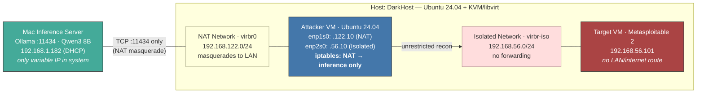

# Dark Agents — Lab Architecture and Design Notes

Standing reference for the lab's physical and virtual layout: host setup, network topology, the dual-layer isolation model, and the inference server design. Read this to understand *why* the lab is structured the way it is; see [`docs/infra-setup-guide.md`](./infra-setup-guide.md) for step-by-step bring-up and [`docs/porting-guide.md`](./porting-guide.md) for porting the agent onto the attacker VM. Supporting detail and example commands are in blockquotes and code blocks.

---

## Phase 1: Host Setup — Ubuntu + KVM

**Why KVM instead of VirtualBox:** On Ubuntu 24.04, the KVM kernel module loads by default and claims VT-x. VirtualBox cannot acquire VT-x when KVM holds it. Rather than fighting the kernel, we use KVM — a Type 1 hypervisor built into Linux, standard in production and cloud environments.

> **What's prescriptive vs. what's mine:**
> *Prescriptive (don't change without re-validating the lab):* Ubuntu 24.04 host, KVM/libvirt stack, the libvirt subnets / MACs / VM IPs, and the iptables rule shape.
> *My setup, shown for transparency — substitute your own:* the host hardware, hostname, Wi-Fi NIC name, and host LAN IP listed below; the Mac inference server's LAN IP wherever it appears in this doc.

> **Host specs (this lab — your hardware will differ):**
> - Ubuntu 24.04.4 LTS (kernel 6.17.0-14-generic)
> - QEMU 8.2.2, libvirt 10.0.0
> - Intel i7-8850H, Quadro P600 (GPU unused — no local inference)
> - Hostname: `DarkHost`, LAN: Wi-Fi (`wlo1`), IP `192.168.1.191`

**What was done:**
- Installed Ubuntu 24.04 LTS Desktop (clean install, USB boot)
- Enabled VT-x and VT-d in BIOS
- Installed KVM/QEMU/libvirt stack (`qemu-kvm`, `libvirt-daemon-system`, `virt-manager`, etc.)
- Added user to `libvirt` and `kvm` groups
- Verified: KVM modules loaded, `kvm-ok` passes, libvirtd running, default NAT network active

**Demo commands (host):**
```bash
kvm-ok                    # "KVM acceleration can be used"
virsh version             # libvirt + QEMU versions
virsh net-list --all      # shows default + darkagents-isolated
```

---

## Phase 2: Network Architecture & VM Setup

### Core Topology: Two libvirt networks

The attacker VM straddles two networks. The target VM is on the isolated network only.

- **Isolated network** (`darkagents-isolated`, `192.168.56.0/24`): No `<forward>` element in the libvirt XML — traffic stays on the bridge. The target has no forwarded or routed path to the LAN or internet. This is where recon happens.
- **NAT network** (`default`, `192.168.122.0/24`): Provides outbound access through the host's IP via masquerading. Used exclusively for reaching the inference server.

> **IP/MAC Reference:**
> | Component | MAC | IP | Network |
> |---|---|---|---|
> | Attacker (NAT) | `52:54:00:DA:00:11` | `192.168.122.10` | default NAT |
> | Attacker (Isolated) | `52:54:00:DA:00:10` | `192.168.56.10` | darkagents-isolated |
> | Target | `52:54:00:DA:01:01` | `192.168.56.101` | darkagents-isolated |
> | Libvirt gateway (NAT) | — | `192.168.122.1` | default NAT |
> | Libvirt gateway (Isolated) | — | `192.168.56.1` | darkagents-isolated |
> | Inference server (Mac) | — | `192.168.1.182` (DHCP — *this lab; yours will differ*) | Home LAN |

### Why NAT Instead of Bridging

Standard Linux bridging is incompatible with most Wi-Fi drivers — they enforce a single-MAC-per-association limit. NAT/masquerading lets the VM share the host's wireless connection seamlessly. This hardware constraint drove the iptables-based isolation approach.

### Dual-Layer Isolation Strategy

1. **NAT boundary** — stateful firewall preventing unsolicited inbound connections from the LAN
2. **iptables on attacker VM** — restricts outbound traffic so the VM can only reach the inference server at `<IP>:11434`

### Why iptables Inside the VM (Not nwfilter at Hypervisor)

The iptables lockdown lives inside the attacker VM because it's part of the agent's operational environment — visible, auditable, and demonstrable from within the VM.

> **Alternative considered — nwfilter (hypervisor-level):**
> More secure (VM cannot modify filters), but less visible to auditors, libvirt-specific, and cumbersome to update. Rules would live in host XML rather than inside the environment being demonstrated.
>
> **Defensible position:** "For a production deployment, defense-in-depth would add hypervisor-level nwfilter rules as a second layer. The current approach prioritizes transparency and demonstrability for this POC."

### Deterministic IPs via DHCP Reservations

IPs are pinned to MAC addresses in libvirt's DHCP config (not static config inside VMs). Rebuilding a VM with the same MAC gives the same IP automatically.

> Only one variable address in the system: the inference server's LAN IP (Mac DHCP lease). Everything else is controlled by libvirt.

### The iptables Lockdown (Script 06)

Five rules on the OUTPUT chain, scoped to the NAT interface only:

> ```
> 1. ACCEPT ESTABLISHED,RELATED on NAT NIC  (return traffic)
> 2. ACCEPT NEW TCP to <inference-IP>:11434  (Ollama API)
> 3. ACCEPT UDP 68→67 to 255.255.255.255    (DHCP discover)
> 4. ACCEPT UDP 68→67 to 192.168.122.1      (DHCP renew)
> 5. DROP everything else on NAT NIC
> ```

These rules only apply to the NAT interface (`enp1s0`). The isolated interface has no iptables rules — it is completely open for recon. The OUTPUT chain's default policy is ACCEPT (not DROP), so traffic on the isolated interface and localhost passes through unaffected. Rules 3-4 keep DHCP working so the VM retains its IP after lease renewal.

> **What each rule does:**
> - **Rule 1 (ESTABLISHED,RELATED):** Allows locally generated outbound packets that are part of an already-established connection on the NAT NIC. Inbound response packets from Ollama traverse the VM's `INPUT` chain, not `OUTPUT`, and are allowed because this lab leaves `INPUT` at its default ACCEPT policy.
> - **Rule 2 (NEW TCP to inference:11434):** The single pinhole — allow new outbound connections, but only to the Ollama server on its specific IP and port. Nothing else.
> - **Rules 3-4 (DHCP):** Allow the VM to request and renew its IP address. Port 68 (client) → port 67 (server). Rule 3 is the initial broadcast discovery; rule 4 is direct renewal to the known gateway.
> - **Rule 5 (DROP):** Block all other outbound traffic on the NAT interface. No internet, no DNS, no LAN scanning.
> - **Default policy ACCEPT:** The DROP in rule 5 targets only the NAT interface. The chain's default is ACCEPT so that isolated-network traffic (recon) and localhost traffic pass through with no restrictions.
>
> **Additional notes:**
> - No DNS allowed — the agent addresses the inference server by IP directly
> - Rules persist across reboots via `netfilter-persistent`
> - Inference server IP saved to `/etc/darkagents/inference.conf` for helper scripts
> - These rules describe IPv4 filtering. If IPv6 is enabled on the attacker VM's NAT interface, add equivalent `ip6tables`/nftables rules or disable IPv6 to avoid an unintended bypass.

### Attacker VM (`darkagents-attacker`)

- Ubuntu 24.04 Server (no GUI — lighter footprint, SSH access from host)
- 8 GB RAM, 4 vCPUs, 40 GB disk, UEFI boot
- Two NICs: NAT (`enp1s0`) + Isolated (`enp2s0`) — names assigned by Ubuntu's `systemd-udev` from PCI bus position; in practice the NAT NIC ends up as `enp1s0` and the isolated NIC as `enp2s0` because of the `--network` order in `infra/02-create-attacker-vm.sh`. Confirm with `ip -br addr show` on the live VM rather than relying on the names.
- Installed tools: nmap, nikto, snmp, netcat, curl, dnsutils, whois, tcpdump, tmux, git, uv, Python 3 dev stack, and iptables-persistent

> **Packages-before-lockdown ordering:** Once iptables locks the NAT interface, `apt` can't reach mirrors. All packages must be installed before lockdown (script 03). `10-temp-open-firewall.sh` exists as an escape hatch for later installs.

### Target VM (`darkagents-target`)

- Metasploitable 2 (Ubuntu 8.04, kernel 2.6.24)
- 1 GB RAM, 1 vCPU, IDE disk bus + e1000 NIC (old kernel lacks VirtIO drivers)
- Isolated network only — no forwarded or routed path to the LAN or internet
- Login: `msfadmin/msfadmin` — intentionally vulnerable, never patched

### Baseline Snapshots

External, disk-only snapshots via `--disk-only --atomic`:
- `darkagents-attacker`: `baseline-post-setup`
- `darkagents-target`: `baseline-clean`

> External disk-only snapshots were used because this lab's libvirt/UEFI configuration does not reliably support internal snapshots for pflash-based UEFI VMs. This is a practical compatibility choice for the current host stack.

**Demo commands (host):**
```bash
virsh list --all                                  # both VMs running
virsh domiflist darkagents-attacker                # two NICs
virsh domiflist darkagents-target                  # one NIC (isolated only)
virsh net-dhcp-leases darkagents-isolated          # pinned IPs
virsh net-dumpxml darkagents-isolated | head -20   # no <forward> element
virsh snapshot-list darkagents-attacker            # baseline snapshot
```

**Demo commands (attacker VM):**
```bash
sudo iptables -L OUTPUT -v -n --line-numbers  # show the 5 rules
ping -c 1 192.168.56.101                       # target reachable (isolated)
ping -c 1 -W 2 1.1.1.1                         # blocked (NAT locked)
```

---

## Phase 3: Ollama & Inference Server

### Model Selection: Qwen3 8B

Selected `qwen3:8b` (Q4_K_M quantization, ~5 GB on disk) for:
- Strong local tool-calling performance in Docker's practical evaluation of local LLMs
- Good schema-following behavior with Ollama's `format` parameter
- 40K context window as packaged by Ollama (set explicitly via `options.num_ctx`) — enough room for accumulated scan results in this POC
- Less aggressive refusal behavior for benign recon-planning prompts
- Apache 2.0 license

> **Why not Llama 3.1 8B:** Llama 3.1 8B has a larger documented model context window than Qwen3 8B, so context size is **not** the reason it was rejected. The lab chose Qwen3 8B primarily for local tool-calling behavior, schema-following behavior, and observed willingness to comply with benign recon-planning prompts. Context in Ollama should be controlled  through `options.num_ctx` rather than relying on model defaults.

> **Fallback model:** `qwen2.5:7b` — slightly smaller, faster, battle-tested longer. Available if Qwen3 proves problematic.

### Inference Server Setup

- **Device:** Apple Silicon Mac (~10-12 GB available for inference after OS and apps)
- **Ollama version:** 0.16.2
- **Listening on:** All interfaces (`0.0.0.0:11434`) — set per session via script 12
- **Auto-start disabled** — Ollama runs only during dev sessions

### Structured Output

Ollama's `format` parameter accepts a JSON schema and constrains generation toward schema-matching JSON. This is what the agent will use to get structured planning output from the LLM.

The agent should still validate every response before execution:
- The output must parse as JSON
- The JSON must match the expected schema
- The requested operation must be in the agent's allowlist
- The target, ports, intensity, and tool arguments must pass local guardrails

Schema-valid JSON is not the same as safe or authorized behavior.

> **Example:** The schema can constrain `operation` to an enum like `["host_discovery", "port_scan", "service_enum", "os_fingerprint"]` and require fields like `tool`, `command_args`, and `reasoning`.

### Thinking Mode & Performance

Qwen3 defaults to thinking ON — it reasons through decisions before responding. This is togglable per request.

| Mode | Response Time | Notes |
|---|---|---|
| Thinking ON | ~14-17s | Better reasoning quality; raw generation ~40 tok/s |
| Thinking OFF | ~2-5s | Use Qwen's `/no_think` switch or Ollama's API-level thinking controls when available |

> **Context window:** Do not rely on Ollama's implicit context default. The agent should set `4096-8192` explicitly via the `options.num_ctx` parameter. Larger context uses more memory because the KV cache grows with context length.

> **Model memory footprint:** ~6-7 GB total at moderate context sizes (5 GB weights + KV cache). Fits comfortably on a 16 GB+ Apple Silicon Mac.

### Session Workflow

1. **Start session (Mac):** `bash infra/12-start-ollama-session.sh` — configures network listening, opens Ollama, verifies binding
2. **If Mac IP changed:** `sudo bash infra/09-update-inference-ip.sh <NEW_IP>` on attacker VM
3. **End session (Mac):** `bash infra/15-stop-ollama-session.sh` — unloads models, stops server, frees memory

### Expected End-to-End Verification

Run `infra/14-verify-connectivity.sh` from the attacker VM after Ollama is listening and the inference IP is current. A correctly configured lab should produce these outcomes:

| Test | Expected |
|---|---|
| Attacker → Ollama (curl + generation) | PASS |
| Structured JSON output (schema-constrained) | PASS |
| Attacker → Internet (post-lockdown) | BLOCKED |
| Attacker → DNS | BLOCKED |
| Attacker → LAN scan | BLOCKED |
| Target → Internet | BLOCKED (no forwarding to LAN or internet) |
| Non-inference ports on Mac | BLOCKED |
| Target reachable on isolated network | PASS |

> **Security note:** Ollama has no built-in authentication. Acceptable in this isolated lab — iptables ensures only the attacker VM can reach it, and only on port 11434.

**Demo commands (Mac):**
```bash
bash infra/13-test-structured-output.sh  # 3 tests: basic JSON, schema-constrained, timed
```

**Demo commands (attacker VM) — single best demo script:**
```bash
bash infra/14-verify-connectivity.sh  # 8-test suite: inference works + everything else blocked
```

---

## All Scripts Reference

Scripts 01-08 run once during setup. Scripts 09-10 are helpers. Scripts 11-15 are Phase 3 (Ollama).

| # | Script | Runs On | Purpose |
|---|---|---|---|
| 01 | `create-isolated-network.sh` | Host | Create isolated libvirt network (no routing) |
| 02 | `create-attacker-vm.sh` | Host | Create attacker VM with dual NICs |
| 03 | `attacker-post-install.sh` | Attacker VM | Install packages (before lockdown) |
| 04 | `create-target-vm.sh` | Host | Import Metasploitable 2 |
| 05 | `pre-lockdown-verify.sh` | Attacker VM | Verify pre-lockdown connectivity |
| 06 | `setup-iptables.sh` | Attacker VM | Apply NAT lockdown |
| 07 | `post-lockdown-verify.sh` | Attacker VM | Verify lockdown effectiveness |
| 08 | `take-snapshot.sh` | Host | Baseline snapshots |
| 09 | `update-inference-ip.sh` | Attacker VM | Update inference server IP in iptables |
| 10 | `temp-open-firewall.sh` | Attacker VM | Temporary firewall open/close |
| 11 | `install-ollama.sh` | Mac | Verify Ollama installation |
| 12 | `start-ollama-session.sh` | Mac | Start session (configure listening, open app) |
| 13 | `test-structured-output.sh` | Mac / Any | Test JSON + schema-constrained output |
| 14 | `verify-connectivity.sh` | Attacker VM | Full 8-test end-to-end verification |
| 15 | `stop-ollama-session.sh` | Mac | Stop Ollama, free memory |

---

## Architecture Diagram



> **Key visual story:** The attacker VM is the only component that touches both networks. Its NAT side is locked so it can initiate traffic only to the Mac's Ollama IP:port. The target is completely walled off on the isolated network. Because the attacker reaches the Mac through libvirt NAT/masquerade, the Mac  sees the connection as coming from `DarkHost`'s LAN IP, not the attacker's `192.168.122.10` address. Only the Mac's DHCP IP is variable — everything inside the libvirt boundary is stable and deterministic.
